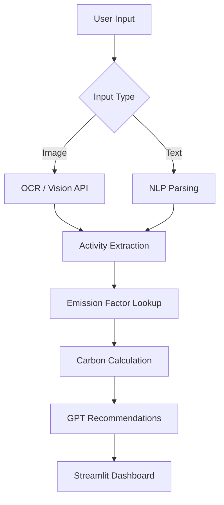

# EcoMate-AI Architecture

## Overview

EcoMate-AI accepts multimodal input (receipt images or free-form text), extracts activities, maps them to verified CO₂ emission factors, and generates personalized sustainability recommendations.

## Pipeline

## Components

| Module | Role |
|--------|------|
| `app/main.py` | Streamlit frontend |
| `app/api.py` | FastAPI backend endpoints |
| `app/genai_model.py` | GenAI inference layer |
| `app/services/carbon_service.py` | CO₂ calculation logic |
| `data/emission_factor.csv` | Verified global emission factors |

## Data Flow

1. User uploads receipt or describes activities
2. OCR / NLP extracts line items and quantities
3. Each item is classified and matched to kg CO₂e factors
4. Totals are broken down by category with global comparisons
5. GPT generates ranked, actionable green tips
